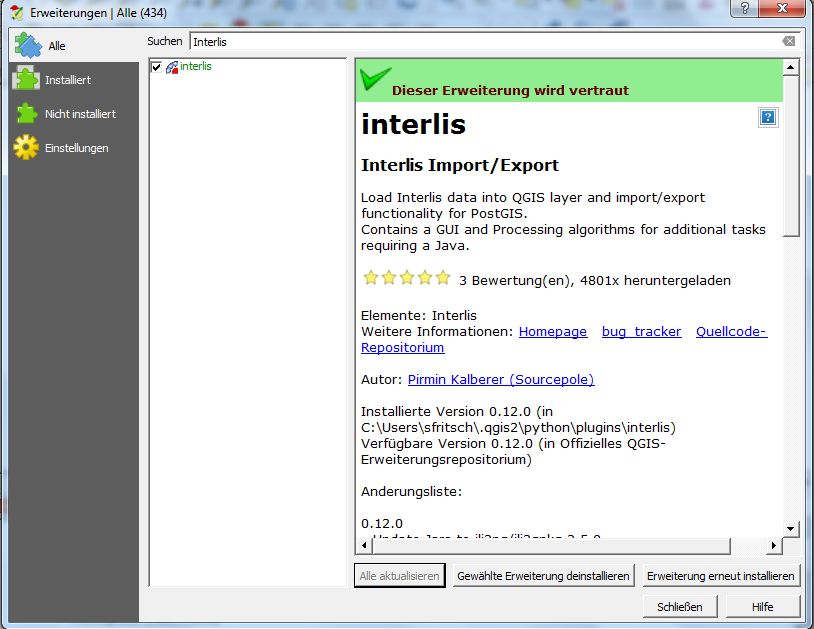
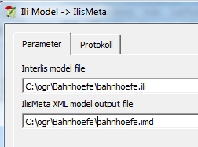
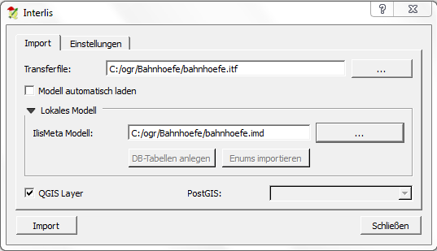
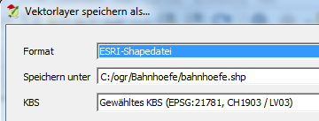
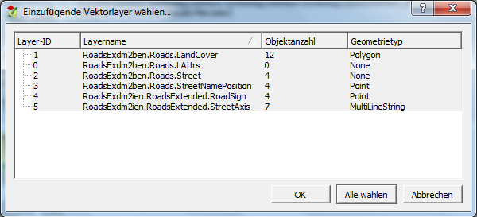
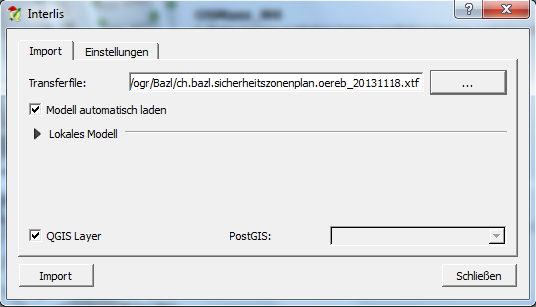

OGR-INTERLIS-Benutzerhandbuch
=============================

Eine Anleitung zur Bedienung von OGR - dem freien Konverter für (Vektor-)Geodaten - mit INTERLIS unter besonderer Berücksichtigung von Microsoft Windows.

Version 7

Im Auftrag von KOGIS 

Stefan Keller, Geometa Lab HSR, www.hsr.ch/geometalab et al.

Weitere Beteiligte: Pirmin Kalberer, Josua Stähli, Dennis Ligtenberg, Severin Fritschi.


Einleitung
==========

Allgemeine Informationen
------------------------

OGR ist ein Werkzeug zum Lesen und Konvertieren von Geodaten. Es ist
Teil einer Softwarebibliothek namens GDAL/OGR und wird von der Open
Source Geospatial Foundation entwickelt. Während GDAL (Geospatial Data
Abstraction Library) Funktionen für das Lesen und Schreiben von
Rasterdaten bietet, ist OGR (OGR Simple Features Library) für das
Konvertieren von Vektordaten zuständig. Eines davon ist OSGeo4W, das auf
die Windows-Plattform ausgerichtet ist und neben GDAL/OGR noch weitere
Werkzeuge enthält. In dieser Anleitung wird die Installation und
Verwendung von diesem Softwarepaket beschrieben, jeweils mit Schwerpunkt
auf OGR und dessen INTERLIS-Unterstützung.

Voraussetzungen
---------------

-  Für die Installation von OSGeo4W werden grundsätzlich
   **Administratorrechte** auf dem PC benötig. Falls Sie nur über ein
   eingeschränktes Benutzerkonto unter Windows verfügen, finden Sie im
   Abschnitt 1.4 Hinweise, wie Sie OSGeo4W trotzdem einrichten können.

-  Damit OGR mit dem INTERLIS-Format umgehen kann, wird ein Compiler
   benötigt. Dieser prüft die Daten im INTERLIS-Format auf Korrektheit
   und wandelt sie in eine Form um, die von OGR weiterverarbeitet werden
   kann. Der Compiler kann von der offiziellen Seite von INTERLIS
   heruntergeladen werden:
   http://interlis.ch/interlis2/download23\_d.php

-  Suchen Sie nach „Compiler für INTERLIS 2“, laden Sie die neuste
   Version des Zip-Archivs herunter und entpacken Sie es (Rechte
   Maustaste > Alle extrahieren…). Von den extrahierten Daten wird nur
   die Datei „ili2c.jar“ benötigt, das ist der Compiler. Das File können
   Sie in einem beliebigen Ordner, wo Sie es wiederfinden, ablegen.
   Dieser Compiler kann sowohl mit INTERLIS 2 als auch INTERLIS 1
   umgehen.

-  Der INTERLIS Compiler wiederum benötigt die Java Runtime Environment
   (JRE) von Oracle, welche das Ausführen von in Java geschriebenen
   Applikationen ermöglicht. JRE ist auf vielen Computern bereits
   installiert. Ob das bei Ihnen der Fall ist, können Sie
   folgendermassen prüfen: Starten Sie die Datei „ili2c.jar“
   (Doppelklick auf die Datei), das heisst, der Compiler aus dem vorher
   entpackten Zip-Archiv. Wenn nun ein Fenster mit der Überschrift
   „ili2c“ erscheint, ist JRE installiert. Wenn Windows die Datei nicht
   ausführen kann, muss JRE zuerst installiert werden. Besuchen Sie dazu
   folgende Website:

   http://www.java.com/de/download/

   Laden Sie die Installationsdatei herunter und führen Sie diese aus.

Installation
------------

| Es stehen, wie erwähnt, verschiedene Softwarepakete mit OGR zum
  Download bereit, die sich im Funktionsumfang und unterstütztem
  Betriebssystem unterscheiden. Wegen der INTERLIS-Unterstützung und
  aktiven Weiterentwicklung empfehlen wir unter Windows die Verwendung
  von OSGeo4W. Besuchen Sie zur Installation folgende Website:
| https://trac.osgeo.org/osgeo4w/
| Laden Sie den „OSGeo4W Installer“ herunter und führen Sie ihn aus. Am
  einfachsten ist die Installation mit der Auswahl „Express Desktop
  Install“. Die Auswahl der zu installierenden Pakete können Sie auf
  „GDAL“ beschränken. Der Installer lädt nun die benötigten Daten aus
  dem Internet, was einige Zeit in Anspruch nehmen kann.

Installation ohne Administratorrechte
-------------------------------------

Wenn Sie nicht über Administratorrechte verfügen, kann der Installer von
OSGeo4W grundsätzlich nicht ausgeführt werden. Sie haben jedoch die
Möglichkeit, OSGeo4W auf einem PC mit Administratorrechten zu
installieren und anschliessend das Verzeichnis C:\\OSGeo4W auf den
Zielrechner ohne Administratorrechte zu kopieren. Das funktioniert, weil
während der Installation keine Einträge in der Registry von Windows
vorgenommen werden.

Alternativ kann auch eine inoffizielle portable Version von QGIS
runtergeladen werden, in der OSGeo4W beinhaltet ist. Diese können Sie
unter folgendem Link herunterladen:
http://www.sourcepole.com/en/seite-1/interlis/

Alternativen
------------

| GDAL/OGR ist auf verschiedenen Betriebssystemen verfügbar. Eine
  Übersicht von Downloadmöglichkeiten finden Sie hier:
| http://trac.osgeo.org/gdal/wiki/DownloadingGdalBinaries

| ogr2gui baut auf OGR auf und bietet dazu eine grafische
  Benutzeroberfläche. Über einen Dialog legt man die Ein- und
  Ausgabeparameter fest und sieht gleichzeigt den Kommandozeilen-Befehl,
  der dazu ausgeführt wird. Für ogr2gui muss GDAL/OGR nicht separat
  installiert werden, jedoch arbeitet eine ältere Version von OGR im
  Hintergrund. INTERLIS wird nicht unterstützt. Herunterladen lässt sich
  ogr2gui hier:
| http://www.ogr2gui.ca/

| Eine weitere Alternative ist der online verfügbare GeoConverter der
  HSR. Dieser ist auf die wichtigsten Einstellungsmöglichkeiten
  reduziert, damit die Bedienung möglichst leicht verständlich ist. Das
  Importieren und Exportieren des INTERLIS-Formats ist möglich. Den
  Geo-Converter finden Sie unter folgender Adresse:
| http://geoconverter.hsr.ch/

OGR und INTERLIS
================

Interlis ist ein modellbasiertes Format, das heisst zu jedem Datensatz
gehört ein Modell (http://interlis.ch). Jeder Datensatz enthält den
Modellnamen. Das Modell (und evtl. damit verknüpfte Modelle) können
entweder lokal, oder im Internet vorhanden sein. Die Software (z.B. der
Interlis Compiler) findet dieses Modell von sich aus, vorausgesetzt sie
unterstützt den Interlis Repository Mechanismus
(http://models.interlis.ch/ModelRepository.pdf).

Zur Vereinfachung vom Austausch und Lesen von Interlis Modellen gibt es
das Ilis-Meta Transferformat (XML) mit der Dateiendung .imd.

Das INTERLIS-Format kann in den Versionen 1 und 2.3 mithilfe von OGR
sowohl gelesen als auch geschrieben werden.

Voraussetzung ist, dass die imd-Datei vorhanden ist, welche das
INTERLIS-Modell in einem für OGR lesbaren XML-Format enthält. Ist diese
Datei in ihren Daten nicht enthalten, kann Sie anhand vom .ili Modell
erstellt werden. Um Daten nach oder von Interlis zu
importieren/exportieren muss mindestens eines der beiden Dateien
vorhanden sein.

Nicht unterstützt sind beispielsweise Kreisbögen (arcs). Bei einer
Konvertierung werden diese durch Liniensegmente ersetzt und so zumindest
angenähert. Der INTERLIS-Treiber behandelt eine INTERLIS-Tabelle/Klasse
als einen Layer und ein INTERLIS-Topic als Teil des Layernamens. So wird
z.B. „Topic t1 Tabelle a1“ zu „Layer t1\_\_a1“.

Ebenfalls zu bedenken ist, dass bei der Konvertierung von INTERLIS 1 zu
einem anderen Format wie z.B. Shapefile Informationen verloren gehen
können. Zwei aneinandergrenzende Flächen besitzen grundsätzlich
gemeinsame Kanten. In der originalen INTERLIS-Datei sind solche
doppelten Kanten nur einmal vorhanden, beim Konvertieren zu z.B.
Shapefile müssen jedoch einzelne Flächen erstellt werden, wodurch die
doppelten Kanten entstehen. Beim Zurückkonvertieren wird nun nicht mehr
der Originalzustand wiederhergestellt.

QGIS Interlis Plugin
====================

Ohne Weiteres können Interlis Daten im OSGeo4W Packet nur via Kommando
Zeile konvertiert werden (mehr dazu im Kapitel 3). Das Interlis Plugin
für QGIS (in der OSGeo4W inbegriffen) bietet jedoch eine grafische
Benutzeroberfläche, welche alle Funktionalitäten für das konvertieren
von Interlis Daten bietet.

Installation Interlis Plugin
----------------------------

| |image0|\ Für die Installation des Interlis Plugins starten Sie zuerst
  QGIS Desktop. Im geöffneten Programm können Sie jetzt eine Liste aller
  erhältlichen Plugins, unter Erweiterungen=>Erweiterungen verwalten und
  installieren In der Menüleiste, finden.
| Geben Sie im Suchfeld „Interlis“ ein und klicken Sie auf Interlis in
  der Liste unter dem Suchfeld. Nun können Sie unten rechts mit
  Erweiterung installieren das Plugin installieren. Das Fenster sollte
  nach erfolgreicher Installation wie folgt aussehen:

Starten Sie nun das soeben installierte Plugin, indem Sie in der
Toolleiste auf folgendes Icon klicken: |image1|

Damit auch die .imd Datei mit dem Plugin erstellt werden kann, muss
unter Einstellungen=>ili2c.jar der Pfad zur bei Kapitel 1.2
heruntergeladenen Datei angegeben werden. Haben Sie zu all ihren
Datensätzen eine dazugehörige .imd benötigen Sie dieses nicht.

Anwendungsfälle
---------------

In diesem Kapitel wird die Verwendung vom Interlis Plugin anhand von
Beispielen erläutert. Als Beispieldaten kommen folgende Datensätze zum
Einsatz:

-  INTERLIS 1:

   http://giswiki.hsr.ch/images/e/e7/Bahnhoefe.zip
   ` <http://www.interlis.ch/interlis1/docs/Beispieldatensatz_24d.zip>`__

-  INTERLIS 2:

   http://www.hsr.ch/fileadmin/user_upload/gis.hsr.ch/gisdata/interlis2_roads.zip

-  INTERLIS 2 mit online Modell:

   http://giswiki.hsr.ch/images/5/54/Bazl.zip

Laden Sie diese Testdaten herunter, entpacken Sie das Zip-Archiv und
platzieren Sie die Dateien in einem einfach erreichbaren Verzeichnis,
beispielsweise „C:\\ogr\\Bahnhoefe“, „C:\\ogr\\interlis2\_roads“ und
„C:\\ogr\\Bazl“.

IMD-Datei erstellen
```````````````````

Um, falls notwendig, die .imd Datei zu erstellen klappen Sie im Model
Register Ili Model auf und geben Sie dort die zum Datensatz gehörende
.itf Datei an. Mit dem Ilis Meta erzeugen Button kann nun die Datei, mit
dem Interlis compiler erstellt werden.

Interlis 1 Dateien in QGIS importieren / anzeigen
`````````````````````````````````````````````````

Benutzen Sie für diesen Schritt die Daten von Bahnhoefe.zip.

|image2|\ Erstellen Sie zuerst die IMD-Ausgabedatei mithilfe der bereits
vorhandenen bahnhoefe.ili Eingabedatei (Teil der Interlis 1 Testdaten).
Hierfür finden Sie in QGIS unter Verarbeitung=>Werkzeugkiste die
gewünschten Verarbeitungswerkzeuge, wobei Sie unter Interlis [7
Geo-Algorithmen]=>ili2c das gesuchte Ili Model -> Ilis Meta Werkzeug
finden. Mit diesem können Sie nun die ILI-Datei, wie auf der Abbildung
zu sehen ist, als Interlis model file definieren und darauf dann
bahnhoefe.imd als output file festlegen. Klicken Sie nun auf Run.

Die soeben erstellte Datei sollte nun unter Modell=>IlisMeta Modell
angegeben werden. Unter Import=>Transferfile müssen Sie zusätzlich die
Datei (welche die eigentlichen Daten enthält) bahnhoefe.itf auswählen.
Wählen Sie jeweils die Dateien mit Klick auf den … Button neben dem
Eingabefeld aus.\ |image3|

Mit Import können jetzt Daten in das QGIS Projekt importiert werden.
Wird nach einem Koordinatenbezugssystem gefragt, wählen Sie LV03. Die
Daten sind jetzt bis auf Weiteres in QGIS geladen, die Geometrien werden
angezeigt und können bearbeitet werden.

Daten von QGIS nach Shapefile exportieren
`````````````````````````````````````````

|image4|\ Um die zuvor importieren Daten ins Shapefile (oder ein
beliebig anderes) Format zu exportieren, klicken Sie mit der linken
Maustaste auf einen Layer in der Liste, mit dem Titel Layerfenster und
wählen Sie Speichern als… Geben Sie im geöffneten Fenster
ESRI-Shapedatei als Format an. Wählen Sie mit Durchsuchen einen
Zielordner und einen Dateinamen für den einzelnen Layer (z.B.:
bahnhoefe.shp). Wiederholen Sie diesen Schritt für alle Layer.

Interlis 2 Dateien in QGIS importieren / anzeigen
`````````````````````````````````````````````````

Benutzen Sie für diesen Schritt die Daten von interlis2\_roads.zip.

Erstellen Sie wie zuvor die .imd Datei mit RoadsExdm2ien.ili als Input-
und RoadsExdm2ien.imd als Output Datei.

|image5|\ Wählen Sie nun als IlisMeta Modell die soeben erstellte Datei
an und unter Import=>Transferfile / RoadsExdm2ien.xml wie in Kapitel
3.2.2 aus. Importieren Sie die Daten jetzt mit Import. Wird nach einem
Koordinatenbezugssystem gefragt wählen Sie wieder LV03 (Sie werden
möglicherweise mehrmals gefragt). Im geöffneten Fenster mit der
Überschrift Einzufügende Vektorlayer wählen… klicken Sie auf Alle wählen
und dann auf OK. Nach diesen Schritten sollten die Daten auch hier
importiert sein und angezeigt werden. Um auf die importierten Geometrien
zu zoomen wählen Sie in der Layerliste links den Layer
RoadsExdm2ben.Roads.LandCover und klicken Sie auf die Lupe mit den 3
Pfeilen in der Menüleiste.

Exportieren von Daten in QGIS nach INTERLIS 1 + 2
`````````````````````````````````````````````````

Um mit dem Interlis Plugin Daten nach Interlis zu exportieren, müssen
die Daten in einer PostGIS Datenbank gespeichert sein. Ändern Sie dafür
im Plugin den Speicherort von QGIS Layer zu einer verbundenen Datenbank
(das Passwort muss in der Verbindung gespeichert sein). Die .imd Datei
muss auch hier bereits vorhanden sein.

Wollen Sie Dateien vom Shapefile Format nach Interlis konvertieren,
benutzen sie die Kommandozeile (Kapitel 4).

Interlis 2 Dateien mit online Modell in QGIS importieren / anzeigen
```````````````````````````````````````````````````````````````````

Das Interlis Plugin bietet eine Funktion an, mit der man online
gespeicherte Modelle herunterladen und compilen kann.

|image6|\ Benutzen Sie für dieses Beispiel die Heruntergeladene Datei
ch.bazl.sicherheitszonenplan.oereb\_20131118.xtf und geben Sie dies
unter Import=>Transferfile an. Nun kann man den Haken bei Modell
automatisch laden setzen, wodurch das Modell automatisch heruntergeladen
und kompiliert wird. Das funktioniert nur wenn der Modellname in der
Eingabedatei angegeben und im offiziellen Repository abgespeichert ist.

Nach diesem Schritt ist das IMD Modell in einem temporären Ordner
gespeichert und sollte unter Modell=>IlisMeta Modell eingetragen sein.
Mit Import können die Daten nun in den QGIS Layer importiert werden.

OGR mit der Kommandozeile
=========================

OGR starten
-----------

Am einfachsten starten Sie OGR über die von OSGeo4W erstellte
Verknüpfung Namens „OSGeo4W“. Sie können diese auch unter „Alle
Programme > OSGeo4W„ finden. OGR besitzt keine grafische
Benutzeroberfläche, nach dem Start öffnet sich ein
Kommandozeilen-Fenster (Terminal). Darin kann OGR direkt aufgerufen
werden, z.B. mit dem Befehl ogr2ogr.

Die Kommandozeile kann auch über das Startmenü von Windows unter „Alle
Programme > Zubehör“ gestartet werden. Sind die nötigen
Umgebungsvariablen nicht gesetzt (siehe FAQs im Anhang), wird der Befehl
ogr2ogr nicht direkt erkannt. In diesem Fall muss der volle Pfad zu OGR
angegeben werden (Bei OSGeo4W z.B. c:\\OSGeo4W\\bin\\ogr2ogr) oder man
kann zuerst in dieses Verzeichnis wechseln mit cd
c:\\OSGeo4W\\bin\\ogr2ogr und dann ogr2ogr auch direkt aufrufen.

Falls sie die portable Version benutzen, müssen Sie im entpackten
Verzeichnis die Datei „QGIS-Portable-CH/OSGeo4W.bat“ ausführen.

Funktionalität prüfen
---------------------

Ob die Installation wie im Kapitel 1 beschrieben geklappt hat, können
Sie testen, indem Sie beispielsweise folgende Zeile in die Kommandozeile
eingeben und die Entertaste drücken:

  ogrinfo --version

Als Ausgabe erscheint die Versionsnummer von GDAL. Geben Sie nun
folgenden Befehl ein:

  ogr2ogr --formats

Es erscheint eine Liste mit allen von OGR unterstützten Formaten mit dem
Hinweise, ob diese nur gelesen oder auch geschrieben werden können. In
der Liste sollten auch die Einträge „Interlis 1“ und „Interlis 2“
vorhanden sein.

ogr2ogr
-------

Mit ogr2ogr kann man Dateien mit Vektordaten von einem Format in ein
anderes konvertieren. Ein möglicher Befehl sieht so aus:

  ogr2ogr -f GPX out.gpx in.kml

Mit diesem Befehl wird die Datei mit dem Namen „in.kml“ eingelesen, von
KML in das GPX-Format umgewandelt und in der Datei „out.gpx“
gespeichert.

Mit dem Parameter „f“ wird das gewünschte Ausgabeformat angegeben, in
diesem Beispiel ist das GPX. Enthält der Name des Formats ein
Leerzeichen, muss er in Anführungszeichen stehen, beispielsweise
"Interlis 2". Danach folgen die Namen von Ausgabedatei und Eingabedatei,
auch diese mit Anführungszeichen, falls ein Leerzeichen darin enthalten
ist. Wenn sich diese Dateien nicht in dem Verzeichnis befinden, in dem
die Kommandozeile gerade ist, müssen absolute Pfade angegeben werden
(und dies für jeden im jeweiligen Kommando aufgeführten Dateinamen). Den
aktuellen Pfad der Kommandozeile sieht man auf der linken Seite vor der
Befehlseingabe. Absolute Pfade können beispielsweise so angegeben
werden:

  ogr2ogr -f GPX "c:\\output files\\output.gpx" c:\\ogr\\data.kml

ogrinfo
-------

Damit lassen sich Informationen zu Dateien anzeigen, die sich in einem
von OGR unterstützten Format befinden. Mit folgendem Befehl werden alle
Features von den einzelnen Layern der angegebenen Datei angezeigt:

  ogrinfo –al in.kml

Mit dem Parameter „so“ werden die Informationen zusammengefasst
angezeigt:

  ogrinfo –so in.kml

Falls vorhanden werden Informationen wie Projektion, Ausdehnung und
Schema angezeigt.

Für INTERLIS 2 sieht der Befehl folgendermassen aus:

  ogrinfo –al in.xml,in.imd

Wie Sie die .imd Datei erstellen können Sie im Kapitel 2.6 nachlesen.

ogrtindex
---------

Dieses Werkzeug wird im Zusammenhang mit gekachelten Karten verwendet.
Es erstellt einen sogenannten „tileindex“, das ist eine Liste mit den
einzelnen Kacheln einer Karte. Das kann beispielsweise für MapServer
(mapserver.org) verwendet werden.

Anwendungsfälle
---------------

In diesem Kapitel wird die Verwendung von OGR anhand von Beispielen
erläutert. Als Beispieldaten kommen folgende Datensätze zum Einsatz:

-  INTERLIS 1:

   http://giswiki.hsr.ch/images/e/e7/Bahnhoefe.zip

-  INTERLIS 2:

   http://www.hsr.ch/fileadmin/user_upload/gis.hsr.ch/gisdata/interlis2_roads.zip

Laden Sie diese Testdaten herunter, entpacken Sie das Zip-Archiv und
platzieren Sie die Dateien in einem einfach erreichbaren Verzeichnis,
beispielsweise „C:\\ogr\\Bahnhoefe“ und „C:\\ogr\\interlis2\_roads“.

Speicherort
```````````

Die Kommandozeile, mit der OGR aufgerufen, kann sich in verschiedenen
Verzeichnissen befinden. Das aktuelle Verzeichnis sieht man auf der
linken Seite vor der Befehlseingabe. Die Arbeit mit OGR ist am
einfachsten, wenn das aktuelle Verzeichnis mit dem Verzeichnis
übereinstimmt, wo sich die zu konvertierenden Datensätze befinden. Mit
folgenden Befehlen kann zu dem gewünschten Verzeichnis navigiert werden:

+--------------+---------------------------------------------------------------+
| **Befehl**   | **Beschreibung**                                              |
+==============+===============================================================+
| cd c:\\      | Navigiert zum Stammverzeichnis im Laufwerk C                  |
+--------------+---------------------------------------------------------------+
| cd name      | Navigiert in den Ordner „name“                                |
+--------------+---------------------------------------------------------------+
| cd ..        | Navigiert in das übergeordnete Verzeichnis                    |
+--------------+---------------------------------------------------------------+
| dir          | Listet alle Ordner und Dateien im aktuellen Verzeichnis auf   |
+--------------+---------------------------------------------------------------+

Befindet sich die Kommandozeile in dem Verzeichnis der Testdatensätze,
können die Dateien direkt angesprochen werden. Sonst müssen in den
folgenden Beispielen absolute Pfade für die verwendeten Dateien
angegeben werden, z.B.: c:\\ogr\\interlis1\\Beispieldatensatz\_24d.itf.

IMD-Datei erstellen
```````````````````

Um die IMD-Datei zu erstellen müssen Sie zuerst den Compiler starten,
indem Sie die im Schritt 1.2 heruntergeladene Datei „ili2c.jar“
ausführen. Mit dem Knopf „Add Model (.ili)“ können Ihre .ili Dateien
hinzugefügt werden. Im Bereich „Output“ oben im Fenster, kann die
Ausgabedatei angegeben werden. Wählen Sie im Feld „Kind of Output“
„Generate Model as IlisMeta-Transfer“. Unter „Browse“ können Sie den
Pfad zur Ausgabedatei angeben. Die Dateiendung sollte zur
Verständlichkeit empfohlener massen .imd sein.

Wenn Sie in OGR INTERLIS Daten lesen wollen müssen Sie immer zuerst bei
INTERLIS 1 die ITF Datei oder bei INTERLIS 2 die XML Datei und dann
kommasepariert die wie soeben beschrieben erstelle .imd Datei angeben:

  ogr2ogr -f "ESRI Shapefile" shpdir in.xml,in.imd

  ogr2ogr -f "ESRI Shapefile" shpdir in.itf,in.imd

Allgemeine Informationen zur INTERLIS-Unterstützung in OGR finden Sie
hier:
`www.gdal.org/ogr/drv\_ili.html <http://www.gdal.org/ogr/drv_ili.html>`__

Konvertieren von INTERLIS 1 nach Shapefile
``````````````````````````````````````````

Starten Sie OSGeo4W bzw. die Kommandozeile und wechseln Sie in das
Verzeichnis mit den Testdatensätzen für INTERLIS 1, beispielsweise mit
cd c:\\ogr\\interlis1. Erstellen Sie die benötigte imd Datei (Kapitel
4.6.1), nennen sie diese bahnhoefe.imd. Die Anweisung für die
Konvertierung in das Shapefile-Format lautet folgendermassen:

  ogr2ogr -f "ESRI Shapefile" shpdir bahnhoefe.itf,bahnhoefe.imd

OGR erzeugt einen neuen Ordner mit dem Namen „shpdir“, der die
konvertierten Shapefiles aller Layer enthält. Für jede INTERLIS-Tabelle
wird ein Layer, das heisst ein Shapefile, erzeugt.

Konvertieren von Shapefile nach INTERLIS 1
``````````````````````````````````````````

Wir benutzen den Ordner mit den eben erzeugten Shapefiles. Mit folgendem
Befehl wird das gesamte Verzeichnis wieder zu INTERLIS 1
zurückkonvertiert:

  ogr2ogr -f "Interlis 1" bahnhoefe.itf,bahnhoefe.imd shpdir

Um Daten zu INTERLIS 1 und 2 konvertieren zu können wird immer eine
bereits vorhandene passende .imd Datei benötigt.

Konvertieren von INTERLIS 2 nach Shapefile
``````````````````````````````````````````

Der Befehl für die Konvertierung von INTERLIS 2 nach Shapfile lautet
ähnlich wie bei INTERLIS 1. Wechseln Sie zuerst das Verzeichnis der
Kommandozeile in das Verzeichnis der INTERLIS 2 Beispieldaten,
beispielsweise mit cd c:\\ogr\\interlis2\_roads. Erstellen Sie auch hier
die dazugehörige imd Datei, nennen sie diese RoadsExdm2ien.imd. Benutzen
Sie nun folgenden Befehl:

  ogr2ogr -f "ESRI Shapefile" shpdir RoadsExdm2ien.xml,RoadsExdm2ien.imd

Konvertieren von Shapefile nach INTERLIS 2
``````````````````````````````````````````

Mit diesem Befehl werden wieder alle Shapefiles aus dem vorher
erstellten Verzeichnis zu INTERLIS 2 konvertiert (auf einer Zeile
eingeben):

  ogr2ogr -f "Interlis 2" interlis2.xml,RoadsExdm2ien.imd shpdir

Oder nur ein einzelnes Shapefile:

| ogr2ogr -f "Interlis 2"
| interlis2l.xml,RoadsExdm2ien.imd
| shpdir/RoadsExdm2ben.Roads.LandCover.shp

Anhang
======

FAQ
---

• Wie prüfe ich, ob JRE installiert ist?

    Öffnen Sie die Systemsteuerung und klicken Sie auf „Programme und
    Funktionen“ („Programm deinstallieren“ in der Kategorie-Ansicht).
    Ist JRE installiert, finden Sie in der Liste einen Eintrag mit dem
    Namen „Java“ und einer Versionsnummer (beispielsweise „Java 7 Update
    9“).

• Kann man OGR installieren, wenn man nicht über Administratorrechte
verfügt?

    Da die meisten Softwarepakete mit GDAL/OGR keine Einträge in der
    Registry von Windows vornehmen, kann problemlos der Ordner einer
    vorhandenen Installation von einem PC auf einen anderen übertragen
    werden. Im Kapitel 1.4 finden Sie zudem eine Beschreibung zum
    Einrichten einer portablen Version von OSGeo4W.

• Welche Formate kann ich mit OGR lesen und schreiben?

    Das hängt von den in der Installation vorhandenen Formate-Treiber
    ab. Starten Sie die Kommandozeile und geben Sie folgenden Befehl
    ein:

      ogr2ogr –-formats

    Die Ausgabe ist eine Liste mit allen Formaten, die von dem aktuell
    installierten OGR unterstützt werden. Beachten Sie die Klammern nach
    den Formatnamen, gewisse Formate können ausschliesslich gelesen
    werden (readonly). Sie können nur in Formate exportieren, die von
    OGR auch geschrieben werden können (read/write).

• Warum werden in der Kommandozeile die Befehle ogrinfo und ogr2ogr
nicht erkannt?

    Falls Sie OSGeo4W verwenden, dann ist es am einfachsten, wenn Sie
    die Kommandozeile über die von OSGeo4W erstellte Verknüpfung
    starten. Ansonsten müssen Sie den vollen Pad zu den entsprechenden
    Programmen angeben im Sinne von c:\\<Pfad zum Programm>\\ogr2ogr
    oder Sie können zuerst in das entsprechende Verzeichnis wechseln: cd
    c:\\<Pfad zum Programm>.

    Eine dauerhaftere Lösung ist es, eine sogenannte Umgebungsvariable
    zu setzen. Falls Sie über Administratorrechte verfügen, können Sie
    das folgendermassen tun: Öffnen Sie die Systemsteuerung und gehen
    Sie in den Bereich „System“ (In der Kategorie „System und
    Sicherheit“). Klicken Sie dann auf der linken Seite auf „Erweiterte
    Systemeinstellungen“, wechseln Sie zum Register „Erweitert“ und
    klicken Sie auf „Umgebungsvariablen“. Bei den „Systemvariablen“
    finden Sie den Eintrag „Path“, dort soll das Verzeichnis, in dem
    sich OGR befindet, eingetragen werden. Markieren Sie dazu zuerst den
    Eintrag „Path“ und klicken dann auf „Bearbeiten…“. Löschen Sie auf
    keinen Fall den Inhalt bei „Wert der Variablen“, der neue Pfad soll
    nur angehängt werden. Gehen Sie ganz ans Ende der Zeile, geben Sie
    ein Semikolon (;) ein und ergänzen Sie den Pfad von OGR. Dieser
    lautet beispielsweise „C:\\OSGeo4W\\bin\\”. Nun können die Werkzeuge
    wie „ogrinfo“ und „ogr2ogr“ direkt aufgerufen werden.

• Ist es möglich INTERLIS 1 in INTERLIS 2 und umgekehrt umzuwandeln?

    Ja, solange die .imd Datei auf beiden Seiten vorhanden ist. Für das
    Konvertieren von INTERLIS 1 nach INTERLIS 2 kann der Befehl
    folgendermassen aussehen:

      ogr2ogr -f "Interlis 1" interlis2\_out.itf,interlis2\_out.imd
      interlis1\_in.xml,interlis\_in1.imd

    Und umgekehrt, von INTERLIS 2 nach INTERLIS 1:

      ogr2ogr -f "Interlis 2" interlis1\_out.xml,interlis1\_out.imd
      interlis2\_in.itf,interlis2\_in.imd

• Gibt es weitere Dokumentationen und Tipps zu OGR?

    Ja. Die offizielle Dokumentation ist hier
    http://www.gdal.org/ogr/index.html . Und einige Tipps sind hier zu
    finden: http://giswiki.hsr.ch/OGR .

Befehlsübersicht ogr2ogr
------------------------

Konvertierungen:

• Nach INTERLIS 1:

  ogr2ogr -f "Interlis 1" out.itf,out.imd in.shp

• Nach INTERLIS 2:

  ogr2ogr -f "Interlis 2" out.xml,model.imd in.shp

• Nach Shapefile

  ogr2ogr -f "ESRI Shapefile" shpdir in.itf,model.imd

• Nach SQLite:

  ogr2ogr -f SQLite out.sqlite in.xml,model.imd

Weitere Parameter von ogr2ogr
-----------------------------

• -dsco SPATIALITE=YES

    Erweitert den Export nach SQLite um SspatiaLite

• -s\_srs bzw. –t\_srs

    Angabe der Projektion der Eingabe- bzw. Ausgabedatei als EPSG-Code.
    Bsp: 21781 für CH1903 und 4326 für WGS84.

Das OGR-Objektmodell 
---------------------

Ein Objektmodell bestimmt die Datentypen und die Strukturen, die in
einem System wie OGR verwaltet werden können. Das Objektmodell von OGR
kennt nur eine kleine Auswahl an Datentypen und es ist relational. Es
lehnt sich zudem an das „Simple Feature Access“-Standard des Open
Geospatial Consortiums (bzw. ISO 19125) an. Dieser Standard definiert
den Zugriff auf zweidimensionale Geometrien (point, line, polygon,
multi-point, multi-line, etc.). Es gibt dort einige nennenswerte
Beschränkungen, denen zurzeit auch OGR unterworfen ist. Beispielsweise
werden Kreisbogen nicht unterstützt und pro Tabelle (bzw. Layer) darf
nur ein Geometrieattribut vorkommen.

INTERLIS 2 ist im Gegensatz zu OGR eine objektorientierte Sprache und
kennt mehr Datentypen als OGR. In INTERLIS können Beziehungen,
Struktur-Vererbung, sowie Strukturen (STRUCTURE) vorkommen. INTERLIS
kennt zudem Kreisbogen und mehrere Geometrien pro Klasse. Auch gibt es
in INTERLIS 2 z.B. Zeitangaben. Die entsprechenden Abbildungen (sog.
„Mapping“) sind im INTERLIS 2-Import-Modul direkt „verdrahtet“ und daher
zurzeit kaum befriedigend gelöst.

Konfiguration
-------------

Es gibt in OGR Parameter, die modulspezifisch sind (vgl. die
OGR-Dokumentation http://www.gdal.org/ogr/ogr_formats.html ), wie z.B.
die Kreisbogen-Segmentierung, und solche, die für alle Module gelten wie
z.B. Koordinaten-Transformationen (siehe oben und die OGR-Dokumentation
von ogr2ogr http://www.gdal.org/ogr2ogr.html ).

Wie im vorhergehenden Kapitel erwähnt, gibt es in OGR zurzeit keine
Mapping-Möglichkeiten. Die entsprechenden Abbildungen sind in den
Import- und Exportmodulen bis auf wenige Parameter fest programmiert.

Die festen Vorgaben von OGR machen dessen Bedienung recht einfach – aber
man kann damit auch an Grenzen stossen. Fortgeschrittenen Benutzern
empfehlen wir einerseits den SQL-Dialekt (vgl.
http://www.gdal.org/ogr/ogr_sql.html ) sowie das „OGR Virtual Format“
anzuschauen, mit denen man einen Transfer beeinflussen kann (vgl.
http://www.gdal.org/ogr/drv_vrt.html ). Bei grafikorientierten
Ausgabe-Formaten ist es sogar möglich, eine Grafikkonfiguration („OGR
Feature Style“) anzugeben (vgl.
http://www.gdal.org/ogr/ogr_feature_style.html ). Die entsprechenden
Möglichkeiten – wie auch die Dokumentation – haben jedoch noch
Verbesserungspotential.

Wer eine vollständige Kontrolle über OGR benötigt, dem bleiben
schliesslich die verschiedenen Sprachanbindungen (u.a. C/C++, Python und
Java), die entsprechenden Programmierkenntnisse vorausgesetzt.

Fehlermeldungen und Warnungen
-----------------------------

``c:\ogr>ogr2ogr -f GPX out.gpx in.kml``
::
  FAILURE: Unable to open datasource ‘in.kml' with the following
  drivers.
  ...

    → Die angegebene Inputdatei kann nicht gelesen werden. Entweder
    wurde der Dateiname falsch geschrieben oder es ist in OGR kein
    Treiber für das Format dieser Datei vorhanden.
    
**Fehler 1: Kann angegebene Inputdatei nicht lesen**
``c:\ogr>ogr2ogr -f "ESRI Shapefile" shpdir test2.itf,test2.imd``
::
  Info: ilifile <test2.ili>
  FAILED: Layer Bahnhoefe\_\_Bahnhoefe already exists, and -append not
  specified.
  Consider using -append, or -overwrite.
  ERROR 1: Terminating translation prematurely after failed
  translation of layer Bahnhoefe\_\_Bahnhoefe (use -skipfailures to skip
  errors)

    → Die Ausgabedatei (oder Ausgabeordner) ist bereits vorhanden.
    Löschen sie vor der Konvertierung die schon vorhandene Datei oder
    fügen sie dem Befehl in der Kommandozeile den Parameter -overwrite
    hinzu. Mit dem Parameter –append wird ein existierender Layer mit
    den neuen Daten ergänzt.

``c:\\ogr\\interlis1>ogr2ogr -f "ESRI Shapefile" shpdir``
``Beispieldatensatz\_24d.itf,DM.01-AV-CH\_24d.ili``
::
  Warning 6: Normalized/laundered field name: 'ILI\_Geometry' to
  'ILI\_Geomet'

    → Ein Feldname ist zu lang für das Zielformat und wurde deshalb
    gekürzt. Falls die Kürzung des Namens kein Problem darstellt, kann
    diese Warnung ignoriert werden.

``c:\\ogr\\interlis2>ogr2ogr -f "Interlis 2" interlis2.xml``
``interlis1.itf,model.ili``
::
  Warning 4: Model file '(null)' (interlis2.xml) not found : No such file
  or directory.

    → Es wurde entweder gar kein Modell (ili) angegeben, oder zusammen
    mit der Eingabedatei. Modell müssen zusammen mit Ausgabedatei
    angeben werden.


.. |image1| image:: media/image2.png
   :width: 0.15385in
   :height: 0.15202in





